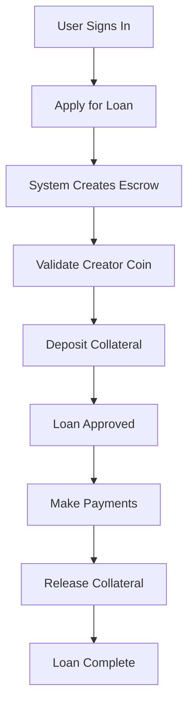

# 🚀 CDP Integration - Creator Loan Platform

## Quick Start (5 Minutes)

### 1. Create Environment File
```bash
# Create .env.local in project root
CDP_API_KEY_ID=your-api-key-id
CDP_API_KEY_SECRET=your-api-key-secret
CDP_WALLET_SECRET=C5ajtK1blreE9A2YfFIE7hBqYc8+YkrpBfex7b6/SmusWPersBCjHSvHDUt/q3cyVL/iO8kpipXO+2DNVf1clQ==
NEXT_PUBLIC_CDP_PROJECT_ID=8d885400-2c82-473e-b9d0-bf5c580a9a5f
NEXT_PUBLIC_NETWORK=base-sepolia
NEXT_PUBLIC_TESTNET=true
```

Get your API keys: https://portal.cdp.coinbase.com/projects/api-keys

### 2. Configure Domain
1. Go to https://portal.cdp.coinbase.com/products/embedded-wallets/domains
2. Click "Add domain"
3. Enter `http://localhost:3000`
4. Click "Add domain" to save

### 3. Run the App
```bash
npm run dev
```

Visit http://localhost:3000 and test the integration!

## 📁 Files Created

### Core Components
```
src/
├── components/
│   ├── providers/
│   │   └── CDPProvider.tsx          # Embedded wallet provider
│   ├── auth/
│   │   └── SignInButton.tsx         # Authentication UI
│   ├── payments/
│   │   └── BasePayButton.tsx        # Base Pay integration
│   └── escrow/
│       └── DepositCollateral.tsx    # Collateral deposit flow
│
├── lib/
│   └── services/
│       └── serverWallet.ts          # Server wallet operations
│
└── app/
    ├── layout.tsx                   # Updated with CDPProvider
    └── api/
        ├── escrow/
        │   ├── create/route.ts      # Create escrow accounts
        │   └── confirm-deposit/route.ts
        ├── zora/
        │   └── validate-coin/route.ts
        └── payments/
            └── process-repayment/route.ts
```

### Documentation
```
├── ENV-SETUP.md                     # Environment setup guide
├── INTEGRATION-GUIDE.md             # Complete integration guide
├── IMPLEMENTATION-EXAMPLES.md       # Code examples
├── INTEGRATION-SUMMARY.md           # Summary & next steps
└── README-CDP-INTEGRATION.md        # This file
```

## 🎯 Use Cases

### 1. User Authentication
```tsx
import { SignInButton } from "@/components/auth/SignInButton";

<SignInButton />
```

### 2. Deposit Collateral
```tsx
import { DepositCollateral } from "@/components/escrow/DepositCollateral";

<DepositCollateral
  loanId="loan-123"
  requiredCollateralAmount={1000}
  creatorCoinAddress="0x..."
  escrowAddress="0x..."
/>
```

### 3. Accept Payments
```tsx
import { BasePayButton } from "@/components/payments/BasePayButton";

<BasePayButton
  amount="100.00"
  recipientAddress="0x..."
  loanId="loan-123"
/>
```

## 🔄 Complete Loan Flow



## 🧪 Testing

### Get Test Funds
1. **ETH**: https://portal.cdp.coinbase.com/products/faucet
2. **USDC**: https://faucet.circle.com (select Base Sepolia)

### Test Checklist
- [ ] Sign in with email
- [ ] Create loan application
- [ ] Validate creator coin
- [ ] Deposit collateral
- [ ] Make payment with Base Pay
- [ ] Verify on BaseScan Sepolia

## 🔐 Security

### Embedded Wallets
- ✅ Non-custodial (user controls keys)
- ✅ MPC (Multi-Party Computation)
- ✅ No seed phrases
- ✅ Automatic backup

### Server Wallets
- ✅ CDP-managed keys
- ✅ Isolated escrow per loan
- ✅ Audit trail
- ✅ Automatic signing

### Base Pay
- ✅ USDC payments
- ✅ On-chain verification
- ✅ No chargebacks
- ✅ Instant settlement

## 📊 Architecture

```
┌─────────────────────────────────────────────────────────┐
│                    User Interface                        │
│  ┌──────────────┐  ┌──────────────┐  ┌──────────────┐  │
│  │ SignInButton │  │ DepositFlow  │  │ BasePayButton│  │
│  └──────────────┘  └──────────────┘  └──────────────┘  │
└────────────────────────┬────────────────────────────────┘
                         │
                         ▼
┌─────────────────────────────────────────────────────────┐
│                  CDP Provider Layer                      │
│  ┌──────────────────────────────────────────────────┐  │
│  │  Embedded Wallets (Client-Side Authentication)   │  │
│  └──────────────────────────────────────────────────┘  │
└────────────────────────┬────────────────────────────────┘
                         │
                         ▼
┌─────────────────────────────────────────────────────────┐
│                    API Routes                            │
│  ┌──────────────┐  ┌──────────────┐  ┌──────────────┐  │
│  │   Escrow     │  │     Zora     │  │   Payments   │  │
│  │   Management │  │  Validation  │  │  Processing  │  │
│  └──────────────┘  └──────────────┘  └──────────────┘  │
└────────────────────────┬────────────────────────────────┘
                         │
                         ▼
┌─────────────────────────────────────────────────────────┐
│                Server Wallet Service                     │
│  ┌──────────────────────────────────────────────────┐  │
│  │  CDP Server Wallets (Escrow Management)          │  │
│  └──────────────────────────────────────────────────┘  │
└────────────────────────┬────────────────────────────────┘
                         │
                         ▼
┌─────────────────────────────────────────────────────────┐
│                    Base Blockchain                       │
│  ┌──────────────┐  ┌──────────────┐  ┌──────────────┐  │
│  │  Smart       │  │    USDC      │  │   Creator    │  │
│  │  Contracts   │  │  Transfers   │  │    Coins     │  │
│  └──────────────┘  └──────────────┘  └──────────────┘  │
└─────────────────────────────────────────────────────────┘
```

## 🎨 Features

### For Users
- 🔐 Sign in with email/SMS/OAuth
- 💼 Automatic wallet creation
- 🪙 Deposit creator coins
- 💳 Pay with USDC (Base Pay)
- ⚡ Instant transactions
- 🔄 Automatic collateral release

### For Platform
- 🏦 Automated escrow management
- 🔍 Creator coin validation (Zora)
- 💰 USDC payment processing
- 📊 Transaction tracking
- 🔒 Secure key management
- 📈 Scalable infrastructure

## 🚦 Production Checklist

Before deploying to mainnet:

- [ ] Get production CDP API keys
- [ ] Update `.env.local` with production credentials
- [ ] Set `NEXT_PUBLIC_NETWORK=base-mainnet`
- [ ] Set `NEXT_PUBLIC_TESTNET=false`
- [ ] Add production domain to CDP Portal
- [ ] Test all flows with small amounts
- [ ] Integrate with production database
- [ ] Replace mock Zora API with real implementation
- [ ] Set up error monitoring
- [ ] Configure logging
- [ ] Test escrow release logic
- [ ] Verify collateral calculations
- [ ] Set up alerts for failed transactions

## 📖 Documentation

| File | Description |
|------|-------------|
| `ENV-SETUP.md` | Environment configuration |
| `INTEGRATION-GUIDE.md` | Complete integration guide |
| `IMPLEMENTATION-EXAMPLES.md` | Code examples & patterns |
| `INTEGRATION-SUMMARY.md` | Summary & next steps |

## 🔗 Resources

- **CDP Portal**: https://portal.cdp.coinbase.com
- **CDP Docs**: https://docs.cdp.coinbase.com
- **Base Docs**: https://docs.base.org
- **BaseScan**: https://basescan.org
- **Zora Docs**: https://docs.zora.co

## 💬 Support

- CDP Discord: https://discord.gg/cdp
- Base Discord: https://discord.gg/base
- Documentation: See files above

## 🎉 What's Next?

1. **Test the integration** on Base Sepolia
2. **Integrate with your database** (Prisma)
3. **Replace mock Zora API** with real implementation
4. **Deploy to production** with mainnet settings
5. **Monitor and optimize** based on usage

---

**Ready to revolutionize creator loans with blockchain technology!** 🚀
